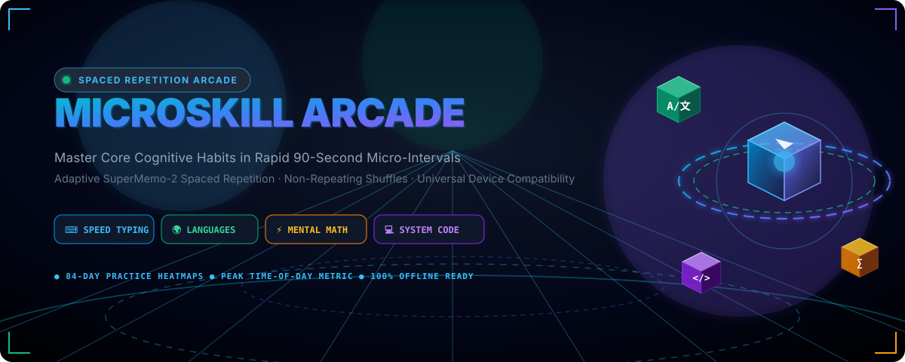
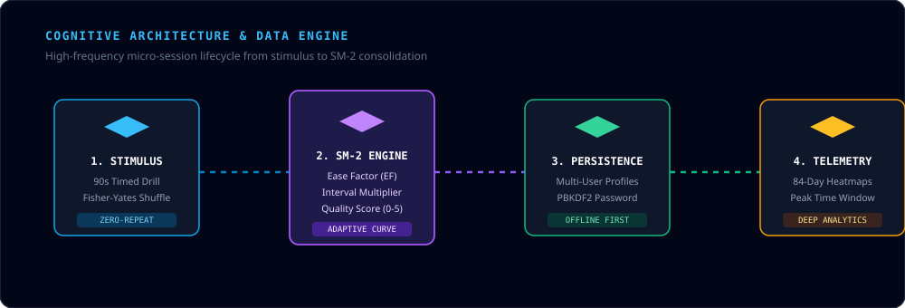
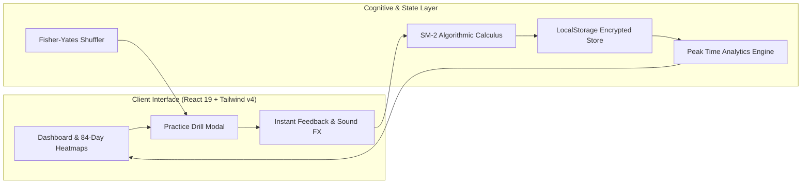

<div align="center">

<!-- 3D Isometric Animated Banner (Click to launch live app) -->
<a href="https://microskillversion-10.vercel.app/" target="_blank">
  
</a>

<br/>

<!-- Dynamic Animated Typing Subtitle -->
<a href="https://microskillversion-10.vercel.app/" target="_blank">
  
</a>

<br/>

<!-- Live Deployment & Technology Shields Badges -->
<p align="center">
  <a href="https://microskillversion-10.vercel.app/" target="_blank">
    
  </a>
  
  
</p>

<p align="center">
  
  
  
  
  
  
</p>

<p align="center">
  <a href="https://microskillversion-10.vercel.app/" target="_blank"><b>🌐 Open Live Project</b></a> •
  <a href="#-live-application"><b>Live Demo Details</b></a> •
  <a href="#-quick-start"><b>Quick Start</b></a> •
  <a href="#-3d-animated-features"><b>3D Features</b></a> •
  <a href="#-cognitive-spaced-repetition-engine"><b>SM-2 Engine</b></a> •
  <a href="#-universal-device-compatibility"><b>Responsive UI</b></a> •
  <a href="#-system-architecture"><b>Architecture</b></a>
</p>

---

</div>

## 🌐 Live Application

The production application is live and accessible on any mobile device, tablet, or desktop browser:

> **🔗 Production URL:** []()

- ⚡ **Instant Launch:** No installation or signup required to test — guest mode works out of the box.
- 📱 **PWA & Cross-Device:** Fully responsive on iOS Safari, Android Chrome, iPads, and high-DPI monitors.
- 🔒 **Zero-Config Local Storage:** All practice records, heatmaps, and SM-2 schedules persist in your browser.

---

## 🌌 Overview

**Microskill Arcade** is a gamified, evidence-based cognitive acceleration platform designed to build automaticity and high-speed intuition across four high-leverage domains: **Speed Typing**, **Polyglot Languages**, **Mental Arithmetic**, and **System Engineering**.

Combining modern **SuperMemo-2 (SM-2) Spaced Repetition algorithms**, **Fisher-Yates non-repeating stimulus shuffling**, and **high-frequency 90-second drills**, the application transforms idle moments into compounding neural mastery.

---

## 💎 3D Animated Features

<div align="center">
  
</div>

<br/>

| Domain | Focus Skills | Target Metric | Cognitive Objective |
| :--- | :--- | :--- | :--- |
| ⌨️ **Speed Typing** | Programming Syntax, High-Freq Digrams, Punctuation Bursts | **120+ WPM** with <1.5% Error | Muscle memory automation of coding characters and symbol combos |
| 🌍 **Polyglot Languages** | Spanish, French, Japanese Vocab & Grammar Assembly | **95%+ 30-Day Retention** | Long-term memory consolidation using adaptive SM-2 intervals |
| ⚡ **Mental Math** | Vedic Shortcuts, Fast Percentages, Prime Factorization | **< 3.0s** Response Latency | Numerical fluency, estimation, and analytical reflex speed |
| 💻 **System Engineering** | Big-O Notation, Bitwise Manipulation, Regex & Logic | **Instant Recall** | Intuitive pattern recognition in technical problem-solving |

---

## 🧠 Cognitive Spaced Repetition Engine

The engine mathematically adjusts review intervals based on user accuracy, latency, and perceived difficulty:

```math
EF' = EF + (0.1 - (5 - q) \times (0.08 + (5 - q) \times 0.02))
```

Where:
- **$EF$** is the Easiness Factor (default $2.5$, floor $1.3$).
- **$q$** is the answer quality grade ($0$ to $5$) calculated from latency and correctness.
- **$I(n)$** intervals scale exponentially: $I(1) = 1\text{ day}$, $I(2) = 6\text{ days}$, $I(n) = I(n-1) \times EF'$.

### 🔄 Fisher-Yates Zero-Repeat Shuffler
Sessions utilize a randomized array permutation algorithm to guarantee that questions and multiple-choice distractors never repeat consecutively within active review cycles:

```typescript
function shuffleArray<T>(items: T[]): T[] {
  const result = [...items];
  for (let i = result.length - 1; i > 0; i--) {
    const j = Math.floor(Math.random() * (i + 1));
    [result[i], result[j]] = [result[j], result[i]];
  }
  return result;
}
```

---

## 📱 Universal Device Compatibility

The application is architected from the ground up to render flawlessly across all form factors:

```
┌───────────────────────────┬───────────────────────────┬───────────────────────────┐
│     📱 Mobile Phones      │     📱 Tablets / iPads    │     💻 Desktop & 4K       │
│      (320px – 640px)      │      (768px – 1024px)     │     (1280px – 3840px)     │
├───────────────────────────┼───────────────────────────┼───────────────────────────┤
│ • 44px+ Min Touch Targets │ • Adaptive 2/3-Col Grids  │ • Constrained Max-W Centering│
│ • Bottom Quick Navigation │ • Touch-First Game Modals │ • Side-by-Side 84-Day Matrix│
│ • Overflow-X Auto Heatmaps│ • Dynamic Fluid Rhythms   │ • High-DPI Visual Glass UI│
└───────────────────────────┴───────────────────────────┴───────────────────────────┘
```

- **Touch Ergonomics**: All interactive multiple-choice buttons, typing inputs, and word tiles adhere to WCAG AAA minimum hit targets.
- **84-Day Practice Heatmaps**: Scrollable horizontal matrix ensures no layout distortion on screens as narrow as 320px.
- **Session Time-of-Day Telemetry**: Automatically records and categorizes your average peak productivity window (*Morning Focus*, *Afternoon Flow*, *Evening Review*, or *Night Shift*).

---

## 🏗️ System Architecture

<div align="center">
  
</div>

<br/>



---

## 👤 Automatic Onboarding & Profile System

When launching the app for the first time, users are greeted with a customized profile creator:
- **Badge Avatars**: Choose from Arcade Bot, Speed Demon, Neural Scholar, Code Wizard, Flame Master, or Zen Master.
- **Daily Practice Target**: Select your goal (3, 5, or 10 micro-sessions/day) with streak tracking.
- **Guest Mode Fallback**: 1-click option to explore as a guest with full local functionality.

---

## 🚀 Quick Start

### Prerequisites
- [Node.js](https://nodejs.org/) (v18.0.0 or higher)
- [npm](https://www.npmjs.com/) or [bun](https://bun.sh/) or [pnpm](https://pnpm.io/)

### Installation

```bash
# 1. Clone repository
git clone https://github.com/garvshaw89-glitch/microskill-arcade.git

# 2. Navigate to project root
cd microskill-arcade

# 3. Install dependencies
npm install

# 4. Start high-speed development server
npm run dev
```

Visit `http://localhost:3000` to access the local app, or test the production build at **[https://microskillversion-10.vercel.app/](https://microskillversion-10.vercel.app/)**.

### Production Build

```bash
# Build optimized static bundle
npm run build

# Preview production build locally
npm run preview
```

---

## 📂 Project Structure

```
├── assets/
│   ├── banner-3d.svg        # 3D animated hero header with floating isometric cubes
│   ├── features-3d.svg      # 3D animated domain feature pedestals
│   └── architecture-3d.svg  # 3D animated data-flow diagram
├── src/
│   ├── components/
│   │   ├── games/           # Typing, Language, Math, & Coding game engines
│   │   ├── AnalyticsView.tsx# 84-day heatmaps & Time-of-Day telemetry
│   │   ├── AuthModal.tsx    # Onboarding, profile creation & auth dialog
│   │   ├── Dashboard.tsx    # Overview, due reviews, and daily streaks
│   │   ├── Navbar.tsx       # Universal responsive navigation bar
│   │   └── ProfileSection.tsx# Account management, stats & export tools
│   ├── data/
│   │   └── initialData.ts   # Curated concept decks and initial review cards
│   ├── lib/
│   │   ├── auth.ts          # Profile state management & account auth
│   │   └── storage.ts       # Spaced repetition engine & local storage
│   ├── App.tsx              # Root application coordinator
│   ├── main.tsx             # React entry point
│   ├── index.css            # Tailwind CSS imports & theme definitions
│   └── types.ts             # TypeScript interfaces for concepts, reviews & sessions
├── package.json             # Project manifest & scripts
├── tsconfig.json            # Strict TypeScript configuration
└── vite.config.ts           # Vite build & bundler configuration
```

---

## 🛡️ Privacy & Local Persistence

- **Zero Cloud Tracking**: All user performance data, accuracy logs, and review schedules remain saved locally in your browser storage.
- **Export & Backup**: Full JSON export and restore capabilities available anytime in the Profile section.

---

<div align="center">

Made with ⚡ for Lifelong Learners and Cognitive Athletes.

<br/>

<a href="https://microskillversion-10.vercel.app/" target="_blank">
  
</a>

</div>
